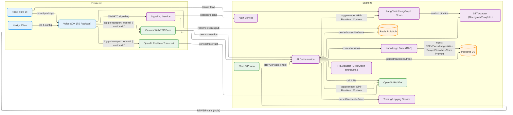

Below is the expanded diagram (keeps your original styling and classdefs). Use a mermaid renderer in your docs site.

```mermaid
---
config:
  layout: elk
---
flowchart LR
  subgraph Frontend["Frontend"]
    RF["React Flow UI"]
    B["Voice SDK (TS Package)"]
    A["Next.js Client"]
    S["Signaling Service"]
    OA["OpenAI Realtime Transport"]
    CR["Custom WebRTC Peer"]
  end
  subgraph Backend["Backend"]
    Auth["Auth Service"]
    Orch["AI Orchestration"]
    KB["Knowledge Base (RAG)"]
    STT["STT Adapter (Deepgram/Groq/etc.)"]
    TTS["TTS Adapter (Groq/Open-source/etc.)"]
    LG["LangChain/LangGraph Flows"]
    OpenAI["OpenAI API/SDK"]
    DB[("Postgres DB")]
    Tracing["Tracing/Logging Service"]
    PubSub[("Redis Pub/Sub")]
    Plivo["Plivo SIP Infra"]
  end
    A -- init & config --> B
    B -- WebRTC signaling --> S
    B -- toggle transport: 'openai' | 'customrtc' --> OA & CR
    RF -- create flows --> LG
    RF -- mount package --> B
    S -- session tokens --> Auth
    S --> Orch
    Orch -- toggle mode: GPT-Realtime | Custom --> OpenAI & LG
    Orch -- context retrieval --> KB
    LG -- custom pipeline --> STT --> Orch --> TTS
    Orch -- call APIs --> OpenAI
    Orch -- persist/transcribe/trace --> DB & Tracing & PubSub
    Plivo -- RTP/SIP calls (India) --> CR & Orch
    OA -- connect/interrupt --> OpenAI
    CR -- peer connection --> Orch
    B -- realtime events/pub --> PubSub
    KB -- ingest: PDFs/Docs/Images/Web Scraps/Searches/Voice Prompts --> DB
    B:::frontend
    A:::frontend
    RF:::frontend
    S:::backend
    OA:::infra
    CR:::infra
    Auth:::backend
    Orch:::backend
    KB:::backend
    STT:::backend
    TTS:::backend
    LG:::backend
    OpenAI:::infra
    DB:::db
    Tracing:::backend
    PubSub:::db
    Plivo:::infra
    classDef frontend fill:#e3f2fd,stroke:#2196f3,stroke-width:2px,rx:8,ry:8
    classDef backend fill:#f3e5f5,stroke:#9c27b0,stroke-width:2px,rx:8,ry:8
    classDef infra fill:#e8f5e9,stroke:#43a047,stroke-width:2px,rx:8,ry:8
    classDef db fill:#fff3e0,stroke:#fb8c00,stroke-width:2px,rx:6,ry:6
```

---

